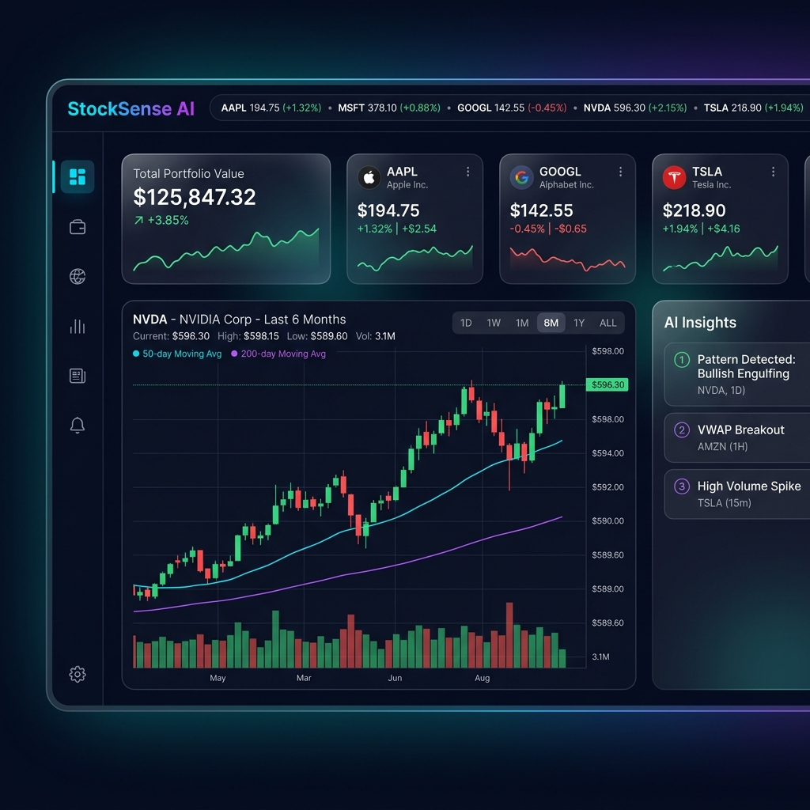
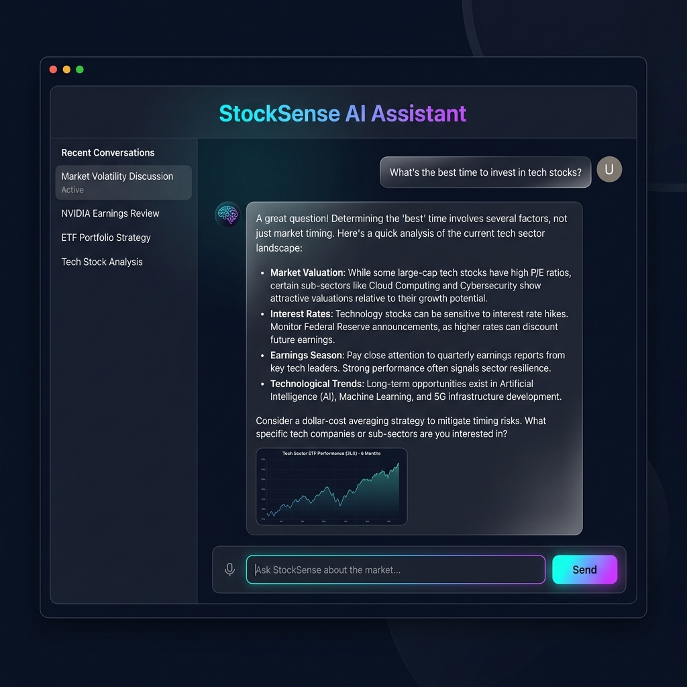
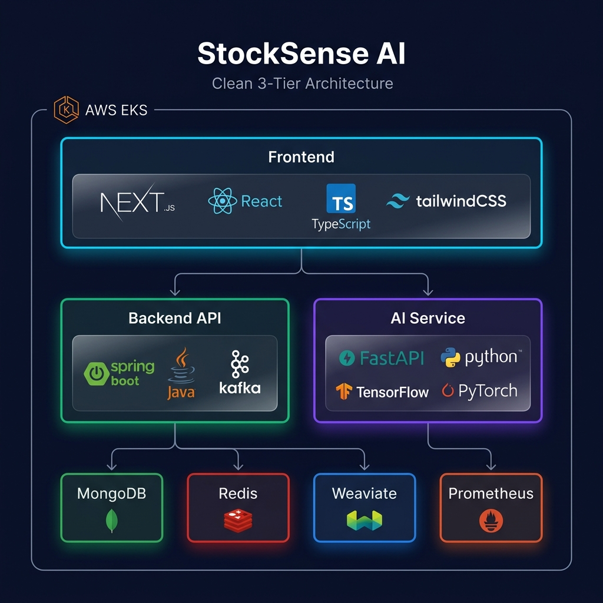

<p align="center">
  
</p>

<h1 align="center">🧠 StockSense AI</h1>

<p align="center">
  <strong>AI-Powered Stock Market Analysis & Portfolio Management Platform</strong>
</p>

<p align="center">
  <em>Real-time market intelligence powered by LSTM, Transformers, and NLP — all in one unified experience.</em>
</p>

<p align="center">
  <a href="https://github.com/saktiswarupmishra/Stocksense-AI/actions"></a>
  <a href="LICENSE"></a>
  
  
</p>

---

## 🖼️ Preview

<p align="center">
  
  <br/>
  <em>📊 Real-time Stock Dashboard with AI Insights & Candlestick Pattern Detection</em>
</p>

<p align="center">
  
  <br/>
  <em>🤖 RAG-Powered AI Chatbot with Voice Assistant</em>
</p>

---

## 🛠️ Tech Stack

### 🎨 Frontend
<p>
  
  
  
  
  
  
  
  
</p>

### ⚙️ Backend
<p>
  
  
  
  
  
  
  
  
</p>

### 🤖 AI / ML Service
<p>
  
  
  
  
  
  
  
  
</p>

### 🗄️ Database & Cache
<p>
  
  
  
</p>

### ☁️ DevOps & Infrastructure
<p>
  
  
  
  
  
  
  
</p>

---

## 🏗️ Architecture

<p align="center">
  
</p>

```
┌──────────────────────────────────────────────────────────────┐
│                    Frontend (Next.js 14)                      │
│              TypeScript • Tailwind CSS • Redux               │
│              Recharts • TradingView • WebSocket              │
├──────────────────────────────────────────────────────────────┤
│                         Nginx / Ingress                      │
├───────────────────┬───────────────────┬──────────────────────┤
│  Backend (Java)   │   AI Service      │   Message Queue      │
│  Spring Boot 3    │   FastAPI         │   Apache Kafka       │
│  Spring Security  │   TensorFlow      │                      │
│  Spring Data      │   PyTorch         │                      │
│  WebFlux          │   Transformers    │                      │
├───────────────────┴───────────────────┴──────────────────────┤
│  MongoDB      │   Redis       │  Weaviate      │ Prometheus  │
│  (Database)   │   (Cache)     │  (Vector DB)   │ (Metrics)   │
└───────────────┴───────────────┴────────────────┴─────────────┘
```

---

## 📋 Overview

StockSense AI is a **production-ready**, full-stack platform combining **real-time market data**, **AI/ML models**, and **modern portfolio management** into a unified experience. Built with a microservices architecture, it features **12 integrated modules** powered by LSTM, Transformer, CNN, and NLP models.

---

## 🚀 Modules

| # | Module | Description | Key Tech |
|:---:|--------|-------------|----------|
| 1 | **🔐 Authentication** | JWT + Google OAuth2 login/register | Spring Security, JWT |
| 2 | **📈 Stock Dashboard** | Real-time prices, interactive charts, search | WebSocket, Recharts |
| 3 | **💼 Portfolio Management** | Holdings, transactions, P&L tracking | Redux, Spring Data |
| 4 | **🔔 Watchlists & Alerts** | Custom lists with price alert notifications | Kafka, WebSocket |
| 5 | **🕯️ AI Pattern Detection** | CNN-based candlestick pattern recognition | TensorFlow, CNN |
| 6 | **🔍 Insider Trading** | SEC Form 4 insider transaction tracker | FastAPI, Pandas |
| 7 | **📊 Mutual Fund Analyzer** | Fund comparison, returns, ratings | scikit-learn |
| 8 | **🚀 IPO Engine** | AI-scored upcoming IPO recommendations | ML Scoring Models |
| 9 | **🤖 AI Chatbot (RAG)** | Vector-search powered financial Q&A | Weaviate, Transformers |
| 10 | **⚖️ Portfolio Rebalancing** | MPT-based AI allocation optimization | NumPy, SciPy |
| 11 | **🎙️ Voice Assistant** | Speech-to-text stock queries | Web Speech API |
| 12 | **📉 Stock Predictions** | LSTM & Transformer price forecasting | PyTorch, LSTM |

---

## ⚡ Quick Start

### Prerequisites

| Requirement | Version |
|-------------|---------|
| 🐳 Docker & Docker Compose | Latest |
| 🟢 Node.js | 18+ |
| ☕ Java (JDK) | 17+ |
| 🐍 Python | 3.11+ |

### 🐳 One-Command Launch (Docker)

```bash
cd infra/docker
docker-compose up --build
```

Services will be available at:

| Service | URL |
|---------|-----|
| 🌐 **Frontend** | http://localhost:3000 |
| ⚙️ **Backend API** | http://localhost:8080 |
| 🤖 **AI Service** | http://localhost:8000 |
| 📊 **Prometheus** | http://localhost:9090 |
| 📈 **Grafana** | http://localhost:3001 *(admin/admin)* |

### 💻 Development Mode

**Frontend:**
```bash
cd frontend
npm install
npm run dev
```

**Backend:**
```bash
cd backend
mvn spring-boot:run
```

**AI Service:**
```bash
cd ai-service
pip install -r requirements.txt
uvicorn app.main:app --reload --port 8000
```

---

## 📁 Project Structure

```
stocksense-ai/
├── 🎨 frontend/              # Next.js 14 + TypeScript + Tailwind CSS
│   ├── src/app/               # App Router pages (12 modules)
│   │   ├── dashboard/         # Real-time stock dashboard
│   │   ├── portfolio/         # Portfolio management
│   │   ├── watchlist/         # Watchlists & alerts
│   │   ├── analysis/          # AI pattern detection
│   │   ├── insider/           # Insider trading tracker
│   │   ├── mutual-funds/      # Mutual fund analyzer
│   │   ├── ipo/               # IPO engine
│   │   ├── chatbot/           # RAG AI chatbot
│   │   ├── rebalance/         # Portfolio rebalancing
│   │   ├── predictions/       # Stock predictions
│   │   ├── voice/             # Voice assistant
│   │   └── login/             # Authentication
│   ├── src/components/        # Reusable UI components
│   ├── src/store/             # Redux Toolkit state management
│   └── src/lib/               # API client, utilities
│
├── ⚙️ backend/                # Spring Boot 3 + Java 17
│   └── src/main/java/com/stocksense/
│       ├── controller/        # REST & WebSocket endpoints
│       ├── service/           # Business logic
│       ├── model/             # MongoDB documents
│       ├── security/          # JWT + OAuth2
│       └── config/            # Security, WebSocket, Kafka configs
│
├── 🤖 ai-service/             # Python FastAPI + ML models
│   └── app/
│       ├── api/               # Prediction, pattern, chat endpoints
│       ├── models/            # LSTM, Transformer, RAG, Pattern detector
│       └── core/              # Configuration
│
├── 🏗️ infra/
│   ├── docker/                # docker-compose.yml
│   ├── k8s/                   # Kubernetes manifests (EKS)
│   └── monitoring/            # Prometheus + Grafana
│
└── 🔄 .github/workflows/      # CI/CD pipelines
```

---

## 🔒 Security

| Feature | Description |
|---------|-------------|
| 🔑 **JWT Authentication** | Access + Refresh token rotation |
| 🌐 **Google OAuth2** | Social login integration |
| 🔐 **BCrypt Hashing** | Secure password storage |
| 🚦 **Rate Limiting** | 100 req/min per user (Bucket4j) |
| 🛡️ **CORS Protection** | Configured for frontend origin |
| 🔏 **Method-Level Security** | `@PreAuthorize` annotations |
| ✅ **Input Validation** | All endpoints validated (Bean Validation) |

---

## 📊 API Endpoints

### 🔐 Authentication
| Method | Endpoint | Description |
|--------|----------|-------------|
| `POST` | `/api/auth/register` | User registration |
| `POST` | `/api/auth/login` | JWT login |
| `POST` | `/api/auth/google` | Google OAuth |
| `GET` | `/api/auth/me` | Current user info |

### 📈 Stocks & Portfolio
| Method | Endpoint | Description |
|--------|----------|-------------|
| `GET` | `/api/stocks/search?q=` | Search stocks |
| `GET` | `/api/stocks/{symbol}` | Stock details |
| `GET` | `/api/stocks/{symbol}/history` | Historical prices |
| `GET/POST` | `/api/portfolio` | CRUD portfolios |
| `POST` | `/api/portfolio/transaction` | Buy/sell |

### 🤖 AI Service
| Method | Endpoint | Description |
|--------|----------|-------------|
| `POST` | `/api/predict/{symbol}` | LSTM/Transformer prediction |
| `POST` | `/api/patterns/detect` | Candlestick patterns |
| `POST` | `/api/chat` | RAG chatbot |
| `POST` | `/api/rebalance` | Portfolio optimization |
| `POST` | `/api/sentiment` | News sentiment analysis |

---

## 🧪 Testing

```bash
# ☕ Backend (JUnit 5 + Mockito)
cd backend && mvn test

# 🐍 AI Service (pytest)
cd ai-service && pytest tests/ -v

# 🎨 Frontend (Jest + React Testing Library)
cd frontend && npm test
```

---

## ☁️ Deployment (AWS EKS)

```bash
# Apply Kubernetes manifests
kubectl apply -f infra/k8s/namespace.yml
kubectl apply -f infra/k8s/ingress.yml
kubectl apply -f infra/k8s/backend-deployment.yml
kubectl apply -f infra/k8s/frontend-deployment.yml
kubectl apply -f infra/k8s/ai-service-deployment.yml
```

---

## 🔧 Environment Variables

| Variable | Description | Default |
|----------|-------------|---------|
| `MONGODB_URI` | MongoDB connection string | `mongodb://localhost:27017/stocksense` |
| `REDIS_HOST` | Redis host | `localhost` |
| `JWT_SECRET` | JWT signing secret | *(required)* |
| `GOOGLE_CLIENT_ID` | Google OAuth client ID | *(optional)* |
| `AI_SERVICE_URL` | AI service URL | `http://localhost:8000` |
| `KAFKA_SERVERS` | Kafka bootstrap servers | `localhost:9092` |

---

## 🤝 Contributing

Contributions are welcome! Please feel free to submit a Pull Request.

1. Fork the repository
2. Create your feature branch (`git checkout -b feature/AmazingFeature`)
3. Commit your changes (`git commit -m 'Add some AmazingFeature'`)
4. Push to the branch (`git push origin feature/AmazingFeature`)
5. Open a Pull Request

---

## 📄 License

MIT License — see [LICENSE](LICENSE) for details.

---

<p align="center">
  <strong>Built with ❤️ by StockSense AI Team</strong>
</p>

<p align="center">
  
  
</p>
